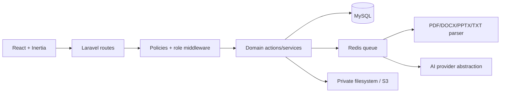

# Architecture

The application is a modular monolith. HTTP controllers are thin and delegate business rules to domain actions/services. Form Requests validate input, policies authorize parent and child resources, Eloquent models express relationships, and Inertia serializes page-specific props. JSON endpoints are limited to autosave, attempts, job status, and background interactions.

Direct center-owned models use the `BelongsToCenter` scope. Indirect resources are constrained through their parent relation in policies and query builders. Student and teacher paths never trust client ownership IDs. Assignment items are snapshots; submissions and grades are persisted independently of later lesson/question edits.
